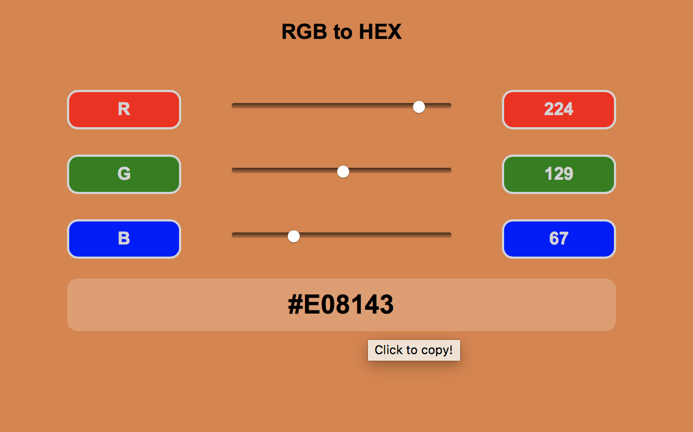

# RGB-to-HEX converter
***

### About

This converter is a personal project for Alpha Camp's Semester 2. 

By moving the sliders for RGB values, you view the corresponding color and get a copiable HEX color code for use.

***
### Updates

+ First launch (*2019 December 29*)

***

### How to use

1. Move the sliders for `R` (**red**), `G` (**green**), and `B` (**blue**). This converter displays in real time: 
+ Corresponding R, G, and B values
+ Specified color as the background color
+ HEX color code
2. To apply the color code for use, click on the HEX color code to copy it.